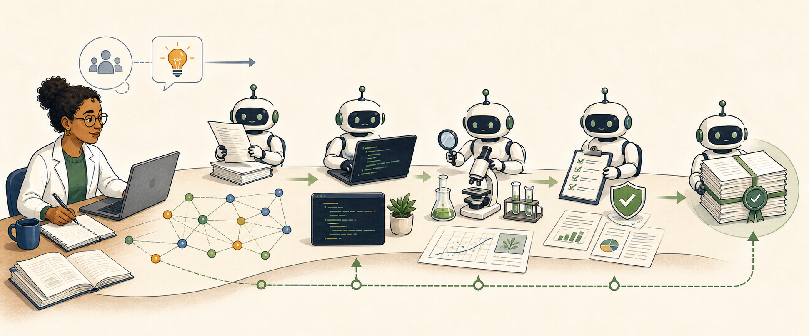
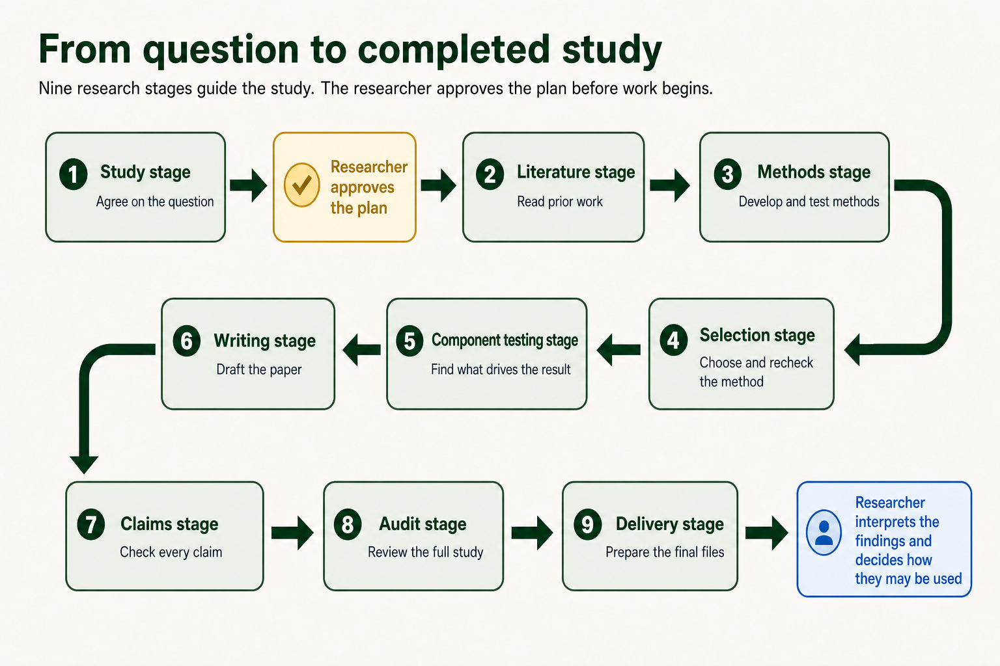
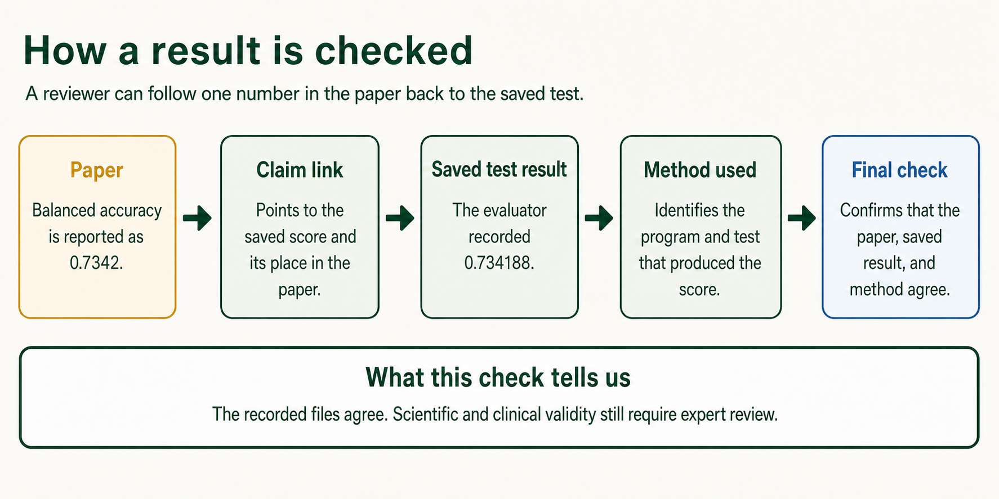

# ScientistOne for Codex



ScientistOne helps you turn a research question into a full study in Codex. You explain what you want to find out and approve the plan. Specialist AI agents then move the study through nine stages: planning, literature review, method development, selection, component testing, writing, claim checking, integrity audit, and delivery. The number of agents adapts to the approved study. Before the work can finish, ScientistOne checks that the numbers in the paper match the saved test results. It also checks that each important claim points to a source or saved result that supports it. If a check fails, the study returns to the stage that needs fixing. You receive the paper with its sources, code, results, and check reports, so you can see how it reached its conclusions.

The design comes from the [ScientistOne research paper](https://arxiv.org/abs/2605.26340) and its Chain-of-Evidence method. This repository is an independent Codex adaptation. Google and the paper's authors do not make or endorse this plugin. The paper's benchmark results do not describe this implementation.

## Why this exists

AI can search papers, write code, compare methods, and explain results. It can also use the wrong data, change a test after seeing the answer, cite a paper it did not read, or write a claim that the saved results do not support.

ScientistOne treats those risks as problems in the research process. The researcher approves the question and evaluation before work starts. Fresh agents get separate jobs. The protocol forbids candidate builders from using hidden answers and records declared access for review. Important claims point back to source records, code, measurements, and receipts.

The result is still AI-assisted research. It still needs human judgment. What changes is that a reviewer has files to inspect instead of a polished answer with no trail behind it.

Regular Codex is a capable general agent. ScientistOne adds a research protocol.

| Regular Codex task | ScientistOne study |
| --- | --- |
| The task may change in conversation. | The researcher approves a written study contract. |
| One context may plan, build, and judge. | Fresh roles split discovery, implementation, evaluation, and audit. |
| Evidence may stay in chat. | Claims point to saved sources, measurements, code, and receipts. |
| Checks may be chosen as work unfolds. | Evaluation and score checks are frozen before candidate results exist. |
| The final answer is the main artifact. | The project keeps code or a protocol, a paper, evidence, and an integrity audit. |

## What Codex adds

Codex gives the workflow a local project, file and command tools, native subagents, and web research when the researcher allows it. ScientistOne uses those tools. It does not ship a second agent runtime.

The lead agent coordinates the study. Each specialist gets declared inputs, outputs, and source permissions. Specialists write files for the next role to inspect. Chat is not the source of truth.

This matters most for score verification. No single formula can cover a near-zero metric, a paired trial, a hardware benchmark, and a study with several outcomes. A fresh result-blind agent writes a declarative policy for the approved task. ScientistOne binds that policy to a release-tested common interpreter, the evaluator interface, inputs, and fixed tolerances before any candidate result exists. A separate auditor later reruns the evaluator and applies that exact frozen policy.

The agents can adapt the policy to the science. They cannot adapt a test to rescue a result they have already seen. If the frozen policy omitted a valid supported result type, ScientistOne preserves the old work, makes the smallest versioned correction, re-audits it, and reruns every affected stage within the fixed repair budget. Unsupported semantics close honestly as incomplete instead of being approximated.



## How a study moves

1. The researcher states the question, inputs, main outcome, limits, and what a negative result would mean.
2. A contract auditor checks that the written plan matches the request and can answer the question.
3. Literature roles search, read, and save source records before proposing directions.
4. Independent roles test several directions and keep failed work as evidence.
5. A separate evaluator applies the frozen protocol. Candidate role instructions forbid access to held-out answers and private checks, and receipts record declared access.
6. Four integrity audits check reported scores, method and result claims, references, and evidence coverage.
7. The study ends only after its declared files and final Chain-of-Evidence verification pass.



## Chain of Evidence

A Chain of Evidence links a statement to what supports it. A number in the paper may point to an evaluator record and the selected code snapshot. A method claim may point to source code and an experiment receipt. A literature claim may point to an exact passage in a saved source record.

That chain does not make a claim true. It makes the support visible. A reviewer can see where the claim came from, which step is missing, and what must be rerun.

## Privacy model

In Codex desktop, ScientistOne uses one MCP bundled with the plugin. It binds to `127.0.0.1`, opens the full browser workflow, and writes intake files only inside the active project. The same local page becomes the interactive study flowchart after approval. It reads progress from saved run files; it does not send questions, files, paths, citations, results, or study state to a ScientistOne server. Codex still sends the prompts and content needed for the AI service to OpenAI. ScientistOne is not an offline tool.

The publisher operates no ScientistOne backend. Read [Data flow and privacy](docs/data-flow-and-privacy.md) and [Privacy](PRIVACY.md) for the full record.

## Install and start

ScientistOne is available through the Codex marketplace in this repository. You can add it from the Codex app.

### 1. Open Plugins

1. Open the ChatGPT desktop app.
2. Select **Codex** from the menu at the top left.
3. Select **Plugins** at the top left of the Codex view.

### 2. Add the ScientistOne marketplace

1. Select the plus button at the top right.
2. Select **Add from Marketplace**. Some app versions call this **Add a marketplace**.
3. Paste this marketplace source into **Source**:

```text
AdamHAwad/scientistone-codex-plugin
```

4. If you see **Git ref**, leave it empty.
5. Select **Add** or **Add marketplace**.
6. Wait for the marketplace to appear. You only need to add it once.

### 3. Install ScientistOne

1. Stay on the **Plugins** page.
2. Search for `ScientistOne`.
3. Open the ScientistOne result.
4. Select **Install**.
5. Wait for Codex to confirm the install.

### 4. Trust the launch hook

1. Open a Codex task and enter `/hooks`.
2. Review the ScientistOne plugin hook and select **Trust**.

Codex intentionally skips newly installed or changed plugin hooks until you
trust their exact definition. ScientistOne uses this hook to authorize each
specialist launch and record its bounded attempt, so complete this review after
installation and after an update that changes the hook.

### 5. Start a study

1. Select **Try now** on the ScientistOne page.
2. Codex opens a new task with a ScientistOne example prompt in the message box.
3. Choose the folder where you want the study files to be saved.
4. Read the prompt. Change it if needed, then send it.

On first use, ScientistOne may offer to raise Codex's public parallel-agent
limit to 16. The change is optional, affects only local Codex configuration,
and requires one Codex restart. Declining or using a managed configuration
does not remove any research stage, repetition, evidence check, or audit; it
only limits how much independent work can run at once. Higher concurrency may
consume the user's Codex allowance faster while a study is active.

ScientistOne opens a full-page setup guide in Codex's built-in browser. Explain what you want to study, add any files the study needs, choose the limits, and review the plan. **Approve and start study** is the study's one approval checkpoint. After it, the same page becomes a live flowchart and ScientistOne advances through bounded contract repair, research, writing, verification, audit, and delivery. It does not ask you to approve in-scope generated evaluator, I1-policy, method, or environment repairs again. If the frozen attempt or repair limits are exhausted, it saves a terminal `INCOMPLETE` result instead of looping; corrected work starts as a new run that references the preserved record.

A study may later need a project-specific tool, such as a Python library required by the approved method. ScientistOne first uses existing or reversible project-local tools covered by the approved plan. When a capability would exceed the plan or Codex's enforced safety boundary, ScientistOne keeps that boundary, uses a safe in-scope alternative, and records the limitation instead of pausing to request a broader study approval. That tool belongs to the study, not to ScientistOne itself.

## What a study saves

A completed study may include the exact request, approved plan, source records, search logs, candidate code, experiment records, the selected method, a canonical evaluation, a paper, claim provenance, an I1 to I4 integrity audit, and a reproduction guide.

The exact files depend on the approved task and available tools. A PDF needs a compatible TeX compiler. A hardware claim needs the declared hardware. ScientistOne does not promise a positive result, a complete literature record, or the performance reported in the original paper. It records null results and limits instead of hiding them.

## Security boundary

Fresh subagent contexts reduce carryover from earlier conversation. They are not operating-system sandboxes. Roles may share the same project filesystem. Path rules, hashes, and receipts make that access easier to audit, but they cannot protect a secret from a malicious process with the same filesystem rights.

Do not use this workflow as the only control for regulated data, credentials, dangerous wet-lab work, clinical decisions, or untrusted code. Use an isolated environment and qualified human review when the field requires them.

Read [Architecture](docs/architecture.md), [Permissions](docs/permissions.md), and [Security](SECURITY.md) before using ScientistOne with sensitive work.

## Repository map

```text
.agents/plugins/marketplace.json   Codex marketplace catalog
plugins/scientistone/   Installable plugin bundle
docs/                   Architecture, privacy, permissions, and release verification
scripts/                Packaging and hygiene checks
```

This repository is the ScientistOne Codex marketplace. Its catalog points Codex to `plugins/scientistone/`, which contains the complete local MCP, browser interface, three skills, launch-authorization hook, launchers, licenses, and brand assets.

For verification, `npm run package:plugin` copies the installable plugin into `dist/scientistone/` from an explicit allowlist. It leaves out tests, caches, secrets, run output, and repository-only files. [Plugin bundle](docs/plugin-bundle.md) lists the included paths and exclusions. [Release tests](docs/release-tests.md) describes the clean-install checks.

## Development

Contributors need Node.js 24 and npm 10 or newer.

```bash
npm ci
npm test
npm run audit:release
```

Tests use local fixtures and do not need network access. Read [Contributing](CONTRIBUTING.md) before changing the research contract or privacy model.

## Research origin and citation

ScientistOne and Chain of Evidence were proposed in:

> Meng et al. *ScientistOne: Towards Human-Level Autonomous Research via Chain-of-Evidence.* arXiv:2605.26340, 2026.

Use [CITATION.cff](CITATION.cff) for machine-readable citation details. [ATTRIBUTIONS.md](ATTRIBUTIONS.md) identifies paper-derived text and figures. This Codex version is an adaptation and needs its own evaluation.

## License and policies

Code uses the [Apache License 2.0](LICENSE). Some documents and images have separate terms in [ATTRIBUTIONS.md](ATTRIBUTIONS.md) and [THIRD_PARTY_NOTICES.md](THIRD_PARTY_NOTICES.md).

- [Privacy](PRIVACY.md)
- [Terms](TERMS.md)
- [Security](SECURITY.md)
- [Support](SUPPORT.md)
- [Contributing](CONTRIBUTING.md)
- [Code of conduct](CODE_OF_CONDUCT.md)
