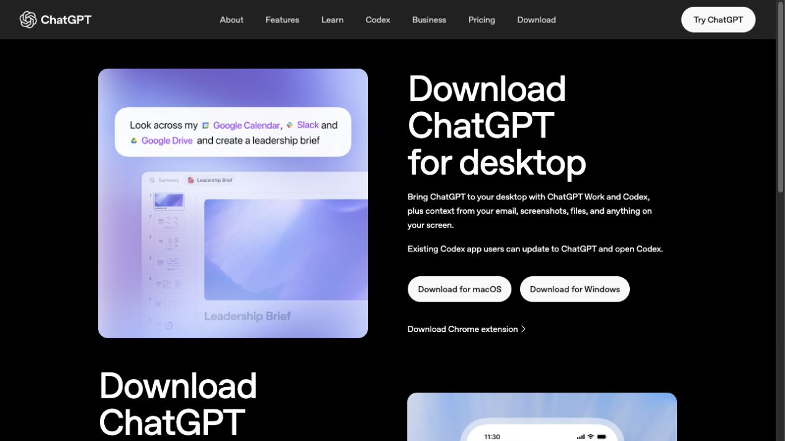
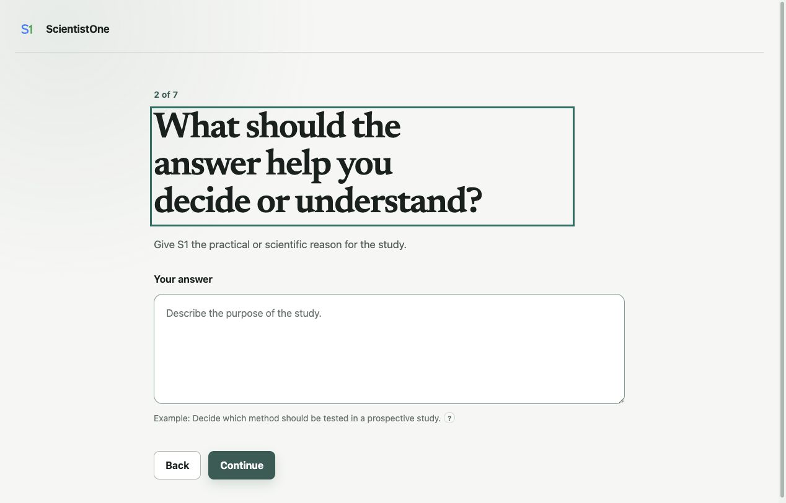
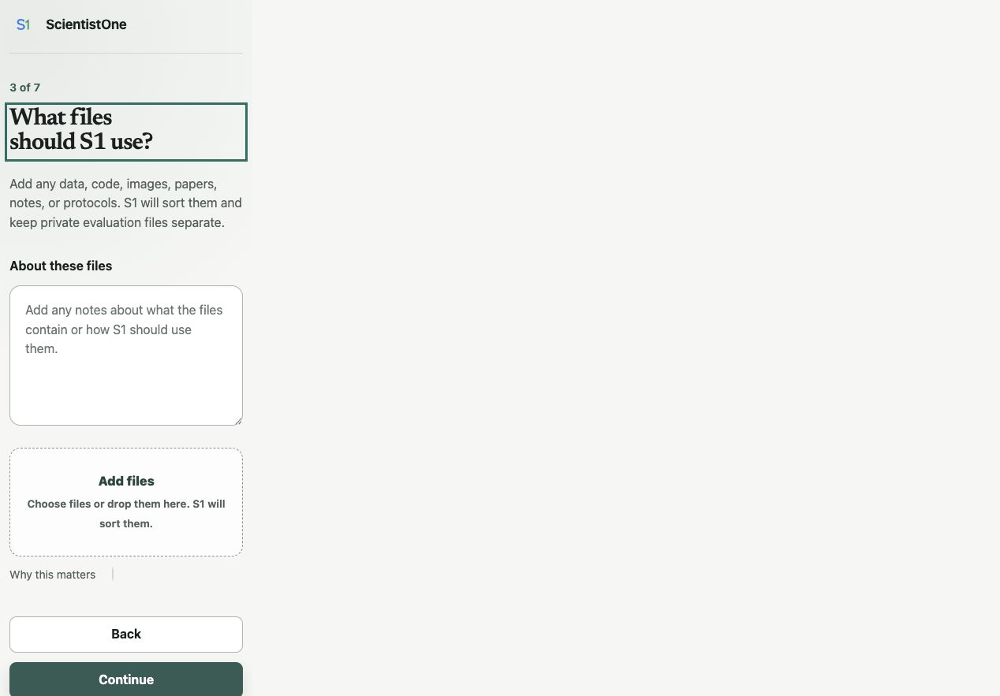
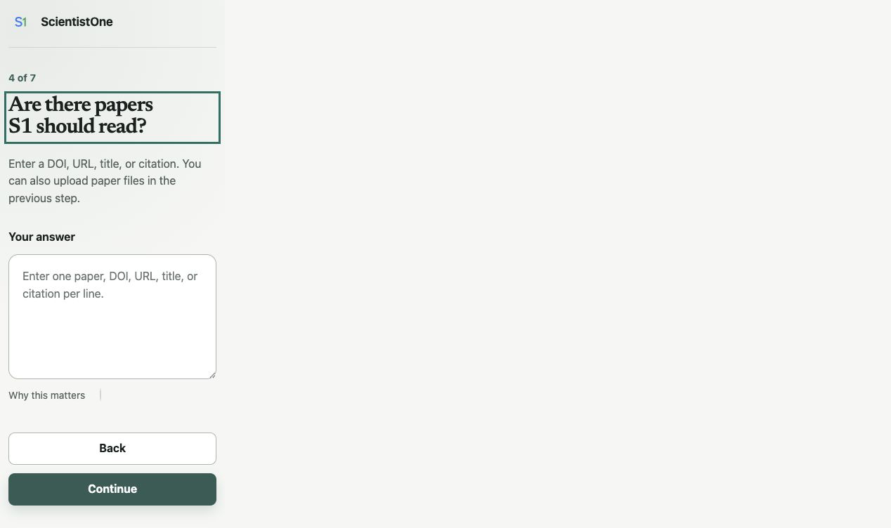
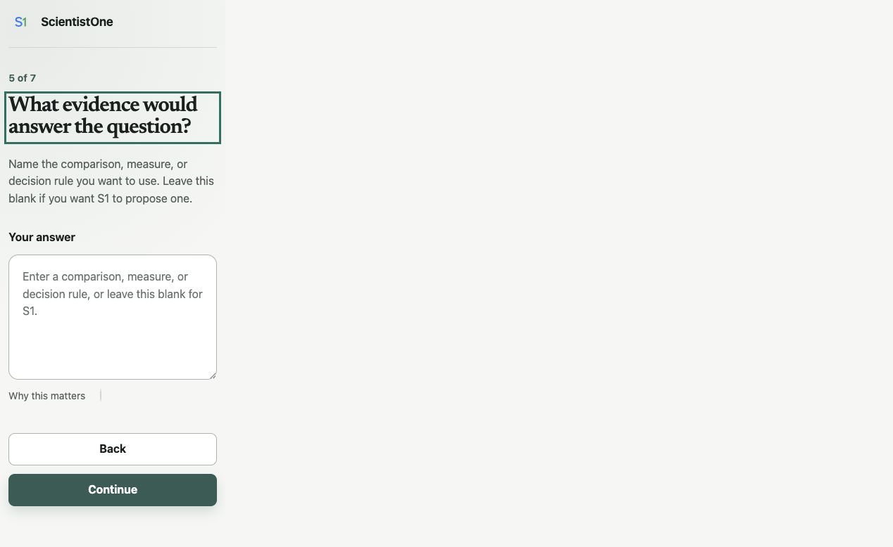
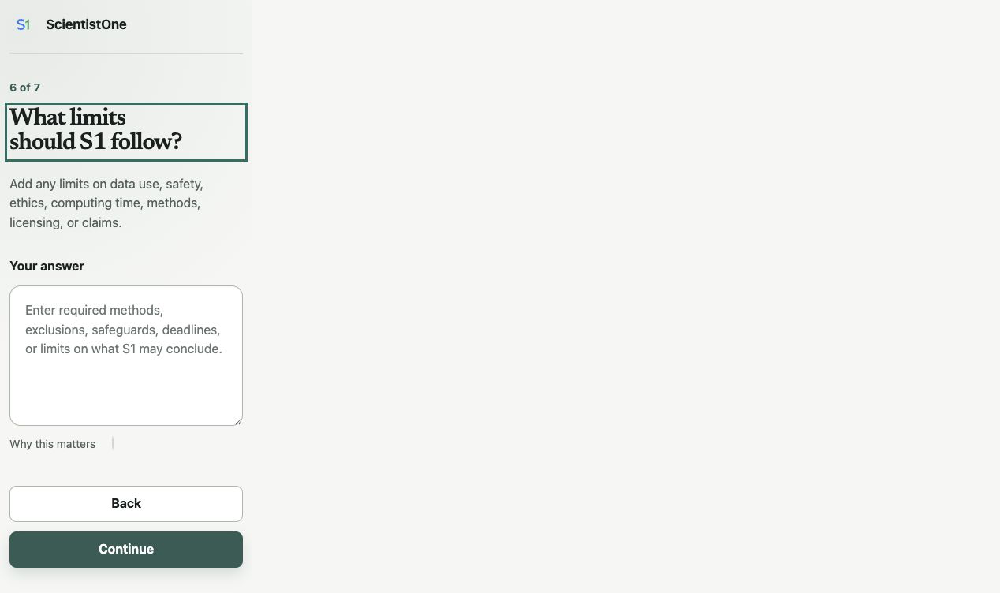
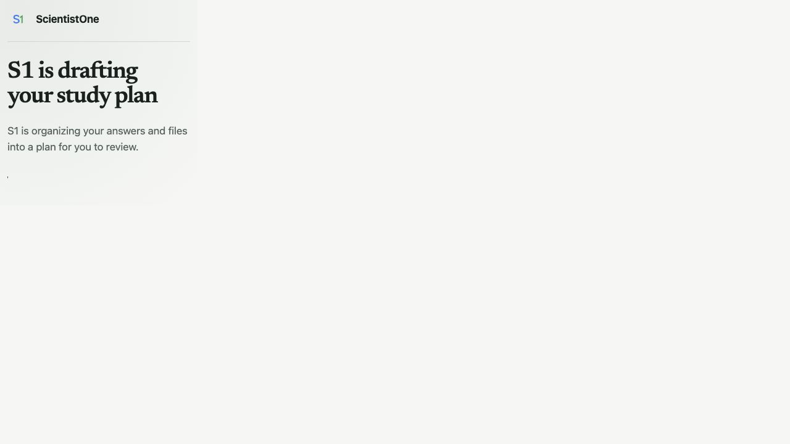
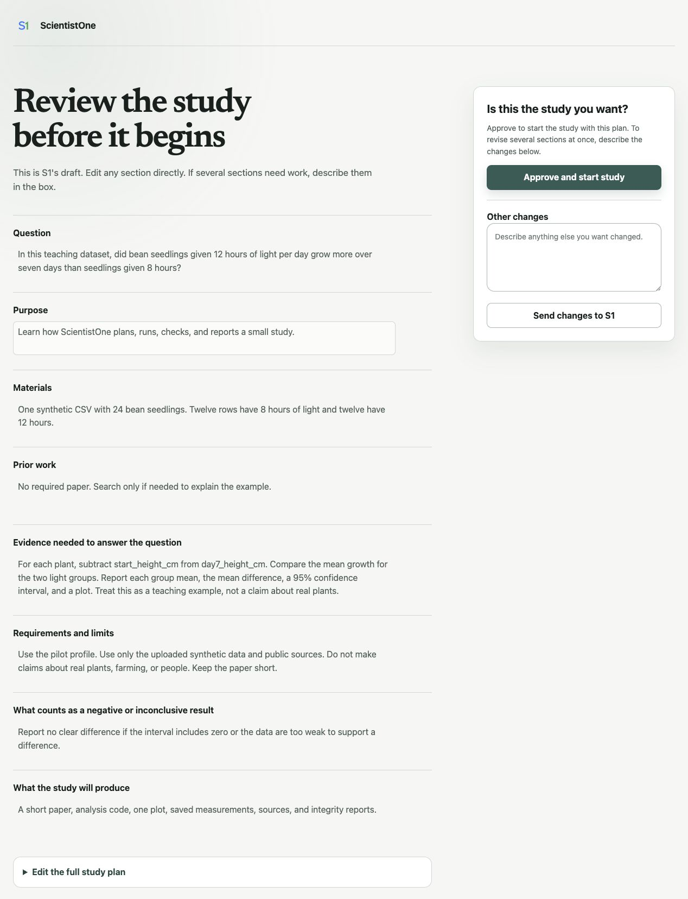

# Run a checked research study with ScientistOne in Codex

## Protocols.io description

ScientistOne helps you plan a study, review the plan, and save the work. You tell it what you want to learn and which files it may use. It can read sources, test methods, compare results, write a paper, and check the paper against the saved evidence. A completed, verified run may include a paper, code, sources, results, and check reports in one folder.

This guide starts at the beginning. It shows you how to get ChatGPT, open Codex, install ScientistOne, run a small practice study, and read the result. You do not need to know how to code. You do need to review the study plan and use your own judgment.

## Keywords

ScientistOne; Codex; AI-assisted research; computational research; research workflow; Chain of Evidence; reproducible research; beginner guide

## Time needed

- About 30 to 60 minutes of your time for setup and the guided practice. This does not include the time the AI study takes to run.
- The AI study can take longer. Time depends on the question, files, plan, model, and your account limits.
- A real study may take hours and may pause to ask you a question.

## Before you start

You will need:

- A computer that can run the current ChatGPT desktop app. This guide was tested on Mac and Windows.
- An internet connection.
- A ChatGPT account.
- Enough Codex use for the study. Free accounts can try Codex, but a full study may reach the account limit.
- Permission to use every file you give to the study.
- A folder where ScientistOne may save its work.

If you use a school, hospital, company, or lab account, your administrator may control Codex and plugins. Ask that person for access if a button is missing or blocked.

## Safety and privacy warning

Do not use this practice with patient records, names, passwords, secret keys, private answer files, or other sensitive data.

For your own studies, follow your lab, school, employer, ethics board, and local law. Remove personal details when you can. Keep private test answers separate. Do not use ScientistOne as the only check for clinical care, dangerous lab work, legal advice, or other high-risk choices.

ScientistOne is designed to make unsupported claims easier to find. This Codex version has not yet been independently tested for research outcomes. It cannot promise that every statement is true. A person with the right subject knowledge must still review the work.

ScientistOne does not send your files to a separate ScientistOne server. Codex still sends your prompts and the content it needs to OpenAI so the AI can do the work. This is not an offline tool.

## Files used in this guide

- `bean-seedling-growth.csv`: a small, made-up dataset with 24 rows. It contains no real people, animals, or experiments.
- The screenshots in this protocol show the current ScientistOne setup page.

The practice file is released as CC0. You may copy and share it.

## What Codex is

ChatGPT and Codex both let you talk with an AI. Codex can also work inside a folder on your computer. With your permission, it can read files, make files, write and run code, and check its work.

Think of the folder as the study's workbench. The chat is where you give directions. The files are the lasting record.

ScientistOne adds a research process to Codex. It does not replace your judgment. It helps keep the question, plan, tests, evidence, paper, and checks together.


## Section 1: Get ChatGPT and open Codex

### Step 1. Check your computer

1. Make sure your computer can run the current ChatGPT desktop app. This guide was tested on Mac and Windows.
2. Save any open work.
3. Make sure you can install an app. On a work or school computer, you may need help from your support team.

For a Mac, OpenAI currently requires macOS 14 or newer. Select the Apple menu, then **About This Mac**, to see your version.

For Windows, OpenAI currently requires Windows 10 version 17763 or newer. Open **Settings**, select **System**, then **About**, and look under **Windows specifications**.

OpenAI also offers a preview app for some Linux computers. This guide does not cover that preview yet.

Why this matters: Codex is a desktop feature. You cannot start this local ScientistOne study from a phone or the normal ChatGPT web page.

### Step 2. Create or open your ChatGPT account

1. Go to [chatgpt.com](https://chatgpt.com/).
2. Select **Log in** if you have an account.
3. Select **Sign up** if you do not have an account.
4. Use an email address you can reach.
5. Finish the sign-in checks shown by OpenAI.

Write down which account you used. You will use the same account in the desktop app.

### Step 3. Choose a plan

Codex is included with Plus, Pro, Business, Enterprise, and Edu. OpenAI also gives Free and Go accounts limited access at the time of this guide. The amount you can use is different for each plan.

1. Open the current [Codex pricing page](https://chatgpt.com/codex/pricing/).
2. Read the Codex limits for each plan.
3. Choose what fits your work:
   - **Free** can be enough to learn the screens and try a small task. A full study may stop at the use limit.
   - **Plus** is a useful starting paid plan for a person who plans to run full studies.
   - **Pro** is for people who expect to run larger or more frequent work.
   - **Business, Enterprise, or Edu** may be supplied by your school or employer. Ask your administrator what is enabled.
4. If you need more use, choose a plan that fits your work.
5. If your school or employer may pay, ask before you buy a personal plan.
6. Before you pay, check the price, billing period, and renewal terms.
7. Return to this guide after your account page shows the plan you chose.

Prices and limits can change. A paid plan does not promise that every full study will finish within its included use. Use the live Codex pricing page, not an old screenshot.

### Step 4. Download the desktop app

1. Go to [chatgpt.com/download](https://chatgpt.com/download/).
2. Choose the download for your computer.
3. Wait for the file to finish downloading.
4. Open the downloaded file.
5. Follow the steps on the screen to install ChatGPT.
6. Open the new **ChatGPT** app.

If you already used the older Codex app, update it. The current desktop app includes Chat, Work, and Codex.



### Step 5. Sign in to the app

1. Select **Sign in**.
2. Use the same ChatGPT account from Step 2.
3. Complete any sign-in check in the browser window.
4. Return to the desktop app.

If you see more than one workspace, choose the one that is allowed to use your research files.

### Step 5A. Check your data controls

Do this before you use real research files.

1. Select your profile picture.
2. Select **Settings**.
3. Select **Data Controls**.
4. Find **Improve the model for everyone**.
5. If you use a personal account and do not want new tasks used to improve OpenAI's models, turn this setting off.

OpenAI says that Business, Enterprise, and Edu inputs and outputs are not used to train its models by default. Your school or employer may have other rules. Follow those rules even if the app allows the file.

Do not use sensitive or regulated files until the person responsible for privacy at your lab, school, hospital, or employer has approved the use of Codex.

### Step 6. Open Codex

1. Find the menu near the top-left corner of the app.
2. Select **Codex**.
3. Wait for the Codex view to open.

If you cannot find Codex:

1. Update the ChatGPT desktop app.
2. Close and reopen the app.
3. Check that you are signed in to the right account.
4. On a managed account, ask your administrator to turn on Codex Local for your role.

### Step 7. Make a safe practice folder

On a Mac:

1. Open **Finder**.
2. Open **Documents**.
3. Select **File**, then **New Folder**.
4. Name the folder `ScientistOne Practice`.

On Windows:

1. Open **File Explorer**.
2. Open **Documents**.
3. Select **New**, then **Folder**.
4. Name the folder `ScientistOne Practice`.

Do not place private files in this folder. The practice study does not need them.

### Step 8. Open the practice folder in Codex

1. Return to Codex.
2. Select **Open folder** or **Open project**.
3. Choose the `ScientistOne Practice` folder.
4. Select **Open**.
5. If the app asks for access to this folder, read the request and allow access.

Why this matters: ScientistOne saves the plan, code, sources, results, paper, and checks in the folder you open.

### Step 9. Try one simple Codex task

Start a new Codex chat in the practice folder. Enter this message:

> Please create a file named hello.txt in this folder. Put one sentence in it that says: Codex can work with files.

Then:

1. Read any permission request.
2. Allow the file change if the request matches the message above.
3. Wait for Codex to finish.
4. Open the folder in Finder or File Explorer.
5. Check that `hello.txt` is there.

You have now seen the basic pattern: ask, review, allow, and check.

### Step 10. Learn what a permission request means

Codex may ask before it changes files, uses a software tool, adds a study package, or uses the internet.

For this lesson, use **Ask for approval** if the app offers a permission mode. If you are unsure, do not allow the action. Ask Codex to explain it in plain language. Use **Allow once** only after you understand the action and have checked that it matches the study and folder. Do not use **Full access**.

Before you allow an action, ask:

- Does this action match my study and folder?
- Does it name a tool or website I trust?
- Could it send private data away from my computer?

## Section 2: Install ScientistOne

ScientistOne comes from its GitHub marketplace. You add the marketplace in the Codex app.

### Step 11. Add the ScientistOne marketplace

1. Open the ChatGPT desktop app.
2. Select **Codex** from the menu at the top left.
3. Select **Plugins** at the top left of the Codex view.
4. Select the plus button at the top right.
5. Select **Add from Marketplace**. Some app versions call this **Add a marketplace**.
6. Paste this exact marketplace source into **Source**:

```text
AdamHAwad/scientistone-codex-plugin
```

7. Copy and paste the source exactly. Do not type it by hand.
8. If you see **Git ref**, leave it empty.
9. Select **Add** or **Add marketplace**.
10. Wait for the marketplace name to appear in the Plugins list. If it appears, continue.

You only need to add this marketplace once. ScientistOne does not ask you to sign in to a second service.

### Step 12. Install and open ScientistOne

1. Stay on the **Plugins** page.
2. Search for `ScientistOne`.
3. Open the ScientistOne result.
4. Select **Install**.
5. Wait for the page to show that ScientistOne is installed.
6. Select **Try now**.
7. A new Codex task should open with a ScientistOne example prompt in the message box.
8. Make sure the open folder is `ScientistOne Practice`. If it is not, select **Open folder** and choose it before you send the check.
9. Replace the example prompt with this short check:

> ScientistOne, tell me in two short sentences what you do. Do not start a study yet.

10. Send the message.

The answer should say that ScientistOne plans and checks research studies. If Codex says it cannot find ScientistOne, go to Troubleshooting at the end of this guide.

## Section 3: Run the practice study

### Step 13. Download the practice data

1. Download `bean-seedling-growth.csv` from the files attached to this protocol.
2. Move the file into your `ScientistOne Practice` folder.
3. Open the file in a spreadsheet app or a plain text app.
4. Check that it has 24 plant rows.
5. Close the file.

The data are made up for teaching. They are not proof about real plants.

If you cannot find the downloaded file on a Mac, open **Finder**, then **Downloads**. On Windows, open **File Explorer**, then **Downloads**. Drag the file into `ScientistOne Practice`.

### Step 14. Start a fresh ScientistOne chat

1. Return to Codex.
2. Make sure the open folder is `ScientistOne Practice`.
3. Start a new chat.
4. Type `@` and select **ScientistOne**. If your app uses Sources, open **Sources**, choose **Use plugins**, and select ScientistOne.
5. Enter:

> Help me run the ScientistOne practice study in this folder.

ScientistOne should open a setup page in the app's built-in browser. Keep the Codex chat and the setup page open.

### Step 15. Enter the research question

On these setup pages, **S1** means ScientistOne.

On screen 1 of 7, the page asks **What should S1 investigate?** Enter:

> In this teaching dataset, did bean seedlings given 12 hours of light per day grow more over seven days than seedlings given 8 hours?

Select **Continue**.

Why this is asked: A clear question tells the team what it must answer. It also stops the task from drifting into a different question.


### Step 16. Enter the purpose

On screen 2 of 7, the page asks **What should the answer help you decide or understand?** Enter:

> Learn how ScientistOne plans, runs, checks, and reports a small study.

Select **Continue**.

Why this is asked: Two studies can use the same data for different reasons. The purpose helps ScientistOne choose a useful plan.



### Step 17. Add the data file

On screen 3 of 7, the page asks **What files should S1 use?**

1. In **About these files**, enter:

   > Synthetic teaching data. Height is in centimeters. Compare each plant's growth, not final height alone.

2. Select the large **Add files** box.
3. Choose `bean-seedling-growth.csv` from the practice folder.
4. Wait until the file name appears on the page.
5. Select **Continue**.

Why this is asked: The note tells the team what the columns mean. The file gives the team the measurements it must use.

The selected file is copied into the open project. Do not add a file that the study should not read.



### Step 18. Add prior work

On screen 4 of 7, the page asks **Are there papers S1 should read?** Leave the box empty. Select **Continue**.

Why this is asked: In a real study, you can add a paper, DOI, title, or web link that the team must read. For this small lesson, no paper is required. ScientistOne may still search public sources. That can use the internet, account use, and extra time.



### Step 19. State what evidence would answer the question

On screen 5 of 7, the page asks **What evidence would answer the question?** Enter:

> For each plant, subtract start_height_cm from day7_height_cm. Compare the mean growth for the two light groups. Report 12-hour growth minus 8-hour growth. Use a two-sided 95% Welch confidence interval for that difference and make a plot. A confidence interval is a range that shows how uncertain the difference is. Treat this as a teaching example, not a claim about real plants.

Select **Continue**.

Why this is asked: This tells the team how you will judge the answer. It makes the main test clear before the team sees a result.

If you do not know the right test in a real study, leave this box empty. ScientistOne will suggest a test for you to review.



### Step 20. State the limits

On screen 6 of 7, the page asks **What limits should S1 follow?** Enter:

> Use the pilot profile. This keeps the practice run small. Use only the uploaded synthetic data and public sources. Do not make claims about real plants, farming, or people. Keep the paper short.

Select **Continue**.

Why this is asked: Limits tell the team what it may use, what it must avoid, and how large the study should be.



### Step 21. Review the request

Screen 7 of 7 is called **Review your study request**. It shows your answers.

1. Read every section.
2. Check that the question compares 12 hours with 8 hours.
3. Check that the file note says to compare growth.
4. Check that the uploaded file is `bean-seedling-growth.csv`.
5. Check that the study is called a teaching example.
6. Select **Back** if anything is wrong.
7. Select **Send to S1** when the request is correct.

Sending the request does not start the study. It asks ScientistOne to draft a plan.

### Step 22. Wait for the draft plan

The page will say that S1 is drafting the study plan.

1. Keep the page open.
2. Return to the Codex chat only if it asks you a question.
3. Do not send the setup form again.
4. Wait for the review page to appear.



### Step 23. Review the study plan

The next page is called **Review the study before it begins**. This is your main stop point. The study has not started yet.

Read these parts:

- **Question:** Is it the question you meant to ask?
- **Purpose:** Will the answer be useful for the reason you gave?
- **Materials:** Does it name the right files and units?
- **Prior work:** Does it include any paper that must be read?
- **Evidence needed:** Is the main comparison clear?
- **Requirements and limits:** Are the privacy, safety, time, and claim limits correct?
- **Negative or inconclusive result:** Does the plan say what it will report if the data do not show a clear difference?
- **What the study will produce:** Does it save what you need?
- **Full study plan:** Do the steps answer the approved question?

You can edit a field on the page. If several parts need work, write one clear note in **Other changes** and select **Send changes to S1**.

Do not approve a plan that you do not understand. Ask Codex to explain any part in plain language.



### Step 24. Approve and start the study

For this practice study, check that the plan says it will:

- use the one CSV file;
- compute seven-day growth;
- report 12-hour growth minus 8-hour growth;
- use a two-sided 95% Welch confidence interval and make a plot;
- avoid claims about real plants; and
- save code, results, a paper, and checks.

If those points are present, select **Approve and start study**.

Approval matters. After this point, the question and main test should not change just because the result is surprising.

### Step 25. Watch the live study map

After approval, the same page becomes a live study map.

1. Look for the current stage.
2. Select a stage to see what it does.
3. Read the stage label:
   - **Not started** means the stage has not begun.
   - **Working now** means Codex is doing that part of the study.
   - **Needs your input** means the study is waiting for you.
   - **Checked** means the required work for that stage passed its checks.
4. Return to the Codex chat if the study asks you to approve a tool or answer a question.
5. Keep the app open and the computer awake while local work is running.

The map shows each part of the study. Select a stage to see what it is doing. The study moves through planning, reading, method work, selection, testing, writing, claim checks, audit, and delivery. A small practice may still take time because the checks are part of the lesson.

### Step 26. Handle questions and tool requests

ScientistOne may ask for a decision. It may also ask Codex to run code, use the web, or install a study-specific package.

For each request:

1. Read what it wants to do.
2. Check that it matches the approved plan.
3. Check that it uses the practice folder.
4. If you are unsure, do not allow the action. Ask for a plain-language reason.
5. Choose **Allow once** only when the request is safe, needed, and within the approved plan.

Do not paste a password, secret key, or patient record into the chat or setup page.

### Step 27. Know what a failed check means

A red stage or a **needs repair** message does not always mean the whole study is lost. It may mean that a number does not match, a claim has no source, a file is missing, or a test needs to be run again.

1. Open the failed stage.
2. Read the plain-language error.
3. Return to the Codex chat.
4. Ask:

   > Explain what failed, what evidence shows the problem, and the safest next step. Do not change the approved question or test without asking me.

5. Approve a repair only if it stays within the plan.

### Step 28. Open the completed results

When the study says it is complete, look for the **Study record verified** badge. If the page says the record **needs repair**, return to the Codex task and ask what must be fixed. Do not treat the study as complete yet.

After the record is verified:

1. Ask in the Codex chat:

   > Show me the main result, the evidence for it, the limits, and the files I should review first.

2. Read the short result in the chat.
3. Open the paper.
4. Open the main result or measurement file.
5. Open the final integrity report.
6. Check that the paper's main number matches the saved result.
7. Follow at least one evidence link from a paper claim to its source or saved result.

For this dataset, the mean growth is about 3.13 cm in the 8-hour group and 4.43 cm in the 12-hour group. The 12-hour minus 8-hour difference is about 1.29 cm. The two-sided 95% Welch confidence interval is about 1.16 to 1.42 cm. These values only check that the practice analysis used the file correctly.


### Step 29. Find the saved study files

Open the `ScientistOne Practice` folder in Finder or File Explorer. Open `scientistone-runs`, then open the newest dated folder.

Open these files first:

1. `deliverables/paper.pdf`, if it exists. If there is no PDF, open `deliverables/paper.tex`.
2. `selection/canonical-evaluation.json` for the main saved measurement.
3. `deliverables/audit-report.md` for the final checks.
4. `deliverables/provenance.jsonl` for links from claims to evidence.

The exact names may vary by study. A complete run can include:

- the request you sent;
- the plan you approved;
- a list of sources;
- analysis code;
- saved measurements and plots;
- the selected method;
- the paper;
- links from claims to evidence;
- check reports; and
- a guide for running the work again.

Do not judge the study only from the final chat message. The saved files are the record.

### Step 30. Finish the practice

You have finished the lesson when you can answer yes to each question:

- Can I open Codex and choose a folder?
- Can I start a new chat with ScientistOne?
- Can I explain the six setup questions and the final review screen?
- Can I review and change a plan before approval?
- Can I follow the live study map?
- Can I find the paper, result, source record, and check report?
- Can I explain why a checked study still needs human review?

You may now delete the practice folder if you do not want to keep it. Check the folder first so you do not remove other work. If you may need the lesson later, copy or archive the folder before you delete it.

## Section 4: Start your own study

### Step 31. Make a new folder for one study

Use one folder for one clear study. Give it a plain name, such as `Lake temperature study` or `Protein model comparison`.

Put only needed files in that folder. Keep an untouched copy of the original data somewhere safe.

### Step 32. Prepare the question

A useful question says:

- what you are studying;
- what you want to learn;
- which groups, methods, or conditions should be compared; and
- which result matters most.

Bad: `Study my data.`

Better: `In these sensor records, did the new calibration lower the median error compared with the old calibration?`

You do not need to name a statistical test if you do not know which test fits. ScientistOne can propose one for you to review.

### Step 33. Prepare the files

Before you add a file:

1. Make sure you have the right to use it.
2. Remove names and other personal details when possible.
3. Write down what each column, unit, image, or code file means.
4. Mark any file that contains hidden answers or private checks.
5. Keep credentials and passwords out of the folder.
6. Check that the file opens.

If a file is very large, tell ScientistOne its size and format before you add it.

### Step 34. State the evidence before the answer is known

Tell ScientistOne what would count as a useful answer. This can be a score, a comparison, a test using data set aside for checking, a clear way to group interview answers, or another clear rule.

Also state what would count as no clear answer. A negative result is a valid result. Do not change the test only because you dislike the first result.

### Step 35. State limits in plain words

Useful limits can include:

- data that must not be used;
- claims the paper must not make;
- a time or cost limit;
- required tools or banned tools;
- safety or ethics rules;
- a date range for sources;
- a software license rule; and
- the files that must be produced.

### Step 36. Review, approve, and stay available

Read the full plan before you approve it. During the run, stay available for questions. Check permission requests. Do not let a repair silently change the question or main test.

At the end, read the limits and audit report before you share the paper.

## Troubleshooting

### ScientistOne is not listed after install

1. Start a new chat. An old chat may not load a new plugin.
2. Open Plugins and check the **Installed** row.
3. Restart the desktop app.
4. Select the plus button, then **Add from Marketplace** or **Add a marketplace**. Check that `AdamHAwad/scientistone-codex-plugin` is listed.
5. If it is missing, add that marketplace source again and search for ScientistOne.
6. On a managed account, ask the administrator whether plugins are allowed for your role.

### Codex is missing

1. Make sure you installed the current ChatGPT desktop app, not only ChatGPT Classic.
2. Update and restart the app.
3. Use the top-left menu to look for Codex.
4. Ask your workspace administrator to enable Codex Local.

### The setup page does not open

1. Keep the Codex chat open.
2. Ask: `ScientistOne, open the study setup again.`
3. Make sure the task has permission to use the built-in browser.
4. Restart the task in a new chat if the plugin was just installed.
5. Do not use a copy of the setup page from an old run.

### The file does not appear after you add it

1. Wait for the upload message to finish.
2. Check that the file is not open in another app.
3. Check that it is inside a folder you can read.
4. Make a copy named `data.csv`, then try that copy.
5. Ask Codex to explain the error before trying again.

### The study reaches an account limit

1. Read the limit message.
2. Open your usage page in ChatGPT settings.
3. Wait for the shown reset time. If you consider credits or another plan, pause and confirm the price, billing period, and renewal terms before you pay.
4. Return to the same project and ask ScientistOne to check the saved run before it resumes.

Do not start a second run unless the saved run cannot be resumed.

### The computer restarts or the app closes

1. Reopen the ChatGPT desktop app.
2. Open Codex and the same study folder.
3. Start a new chat with ScientistOne.
4. Ask: `Check the saved ScientistOne run in this folder and tell me whether it is safe to resume.`
5. Review the status before you allow more work.

### The result looks wrong

Do not ask the team to rewrite the paper first. Ask it to check the evidence:

> Trace the result I am worried about to the saved data, code, measurement, and audit. Tell me where the first mismatch appears.

If the approved test was wrong, stop the run and start a new study with a new approved plan. Do not quietly replace the test after seeing the answer.

## Expected outcome

After following this protocol, a new user should be able to:

- install and sign in to the ChatGPT desktop app;
- open Codex and a local project folder;
- install and select ScientistOne;
- explain each setup question;
- run the small practice study;
- review the plan before work begins;
- follow the live study map; and
- find the paper, code, results, sources, and checks.

## Sources and current product guidance

This protocol was checked on August 27, 2026. Product names and buttons can change.

- [Download ChatGPT for desktop](https://chatgpt.com/download/)
- [ChatGPT desktop preview for Linux](https://learn.chatgpt.com/docs/linux/linux-app)
- [Moving to the new ChatGPT desktop app](https://help.openai.com/en/articles/20001276)
- [Mac system requirements](https://help.openai.com/en/articles/9395554)
- [Using the ChatGPT Windows app](https://help.openai.com/en/articles/9982051)
- [ChatGPT Work and Codex](https://help.openai.com/en/articles/20001275)
- [Using Codex with your ChatGPT plan](https://help.openai.com/en/articles/11369540)
- [Codex pricing](https://chatgpt.com/codex/pricing/)
- [ChatGPT Data Controls](https://help.openai.com/en/articles/7730893-how-chatgpt-uses-browser-history-and-data)
- [Keep chat history while turning off model training](https://help.openai.com/en/articles/8983130-how-does-chatgpt-use-my-data)
- [Plugins in ChatGPT and Codex](https://help.openai.com/en/articles/20001256)
- [Protocols.io help](https://www.protocols.io/help)
- [Add steps, sections, and substeps in Protocols.io](https://www.protocols.io/help/editor/steps-sections-substeps)
- [ScientistOne research paper](https://arxiv.org/abs/2605.26340)

## Citation note

After Protocols.io creates the public version and DOI, use the citation that Protocols.io generates. Do not use a draft citation without the final DOI and version date.
